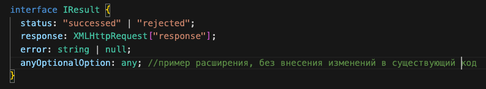
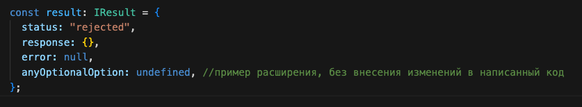
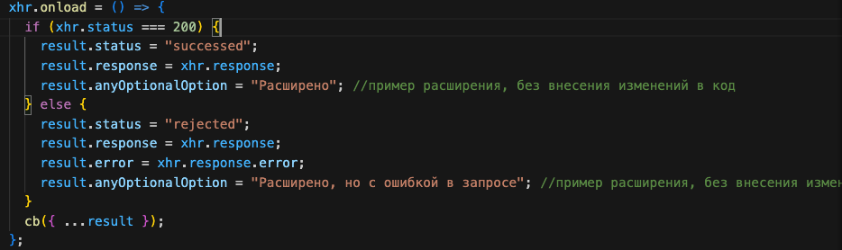
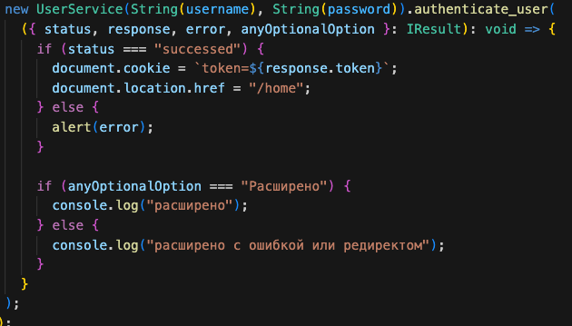

##Тестовое задание

Переписал класс на ts, так как удобнее. Реализация на js была бы громоздкой.

###Проблемы с концепцией
Я думаю, что вся проблема в методе authenticate_user(), он мог бы:

1. Принимать в себя коллбек, с алгоритмом который надо выполнить в случае успешной обработки запроса.
2. Получать токен со стороны бекенда, который бы отправлялся для действий требующих авторизации.

###### В зависимоти от метода авторизации, следует написать разные обработчики:

- **получение JWT-токена после аутентификации:**

  записать полученный токен в хранилище (cookies, localStorage, redux, mobx ...) и передавать его с каждым запросом, на действие, требующее авторизации.

- **отправка запроса каждый раз при действиях, требующих авторизации:**

  написать функцию, замыкающую в себе username и password при аутентификации, затем передавать в нее коллбек.

  > на мой взгляд предпочтительнее использовать JWT, поэтому в дальше код будет идти в сторону токенизации

3. Следующая проблема, которую я для себя отметил, в расширении метода.
   > В событии _onload_ обрабатывается только ответ с кодом 200, и прилетает ошибка если пришел другой код.
   > Казалось бы, соблюдается SRP, класс и его метод отвечают только за авторизацию пользователя в приложении.
   > Но принцип не нарушается, если передавать в метод коллбек. Метод все так же занимается авторизацией пользователя, а в зависимости от ответа сервера он выполнит какой-то коллбек, в него переданный.
   > В итоге код будет чище, понятнее, а расширение метода будет происходить не за счет изменения существующего кода, а за счет передачи колбека и деструктуризации объекта result.
   > Пример:
   > 
   > добавляем новое поле в интерфейс объекта результата, позже весь объект мы передадим в коллбек метода authenticate_user через деструктуризацию
   > 
   > объект результата
   > 
   > передача объекта в коллбек
   > 
   > расширение без изменения текущего кода и соблюдением OCP

---

###Класс UserService

1. _Ошибка_: были объявлены переменные username и password внутри класса.
   _Решение_: объявить свойства класса без ключевых слов _var_, _let_, _const_.
   Так как код написан на TS, то необходимо присвоить свойствам тип данных. Выбрал _string_.

2. Неточность: в конструкторе не хватает валидации.
   _Решение_: сделал валидацию, часть работы выполнил TS
   Таким образом я уверен:

   - что в класс точно будут переданы свойства _username_ и _password_
   - что свойства будут переданы в строковом формате
   - что длина для свойств будет достаточной чтобы считаться за _username_ и _password_

3. _Ошибка_: Геттеры и свойства класса имеют одинакове наименование.
   _Решение_: Добавить к свойствам префикс \_ (нижнее подчеркивание).

---

###Метод authenticate_user

1. _Неточность_: Метод authenticate_user статичный, следовательно не пользволяет обращаться к свойствам класса внутри метода

   > если только не объявить свойства класса статичными, но это теряет смысл в данном контексте
   > _Решение_: преобразовать метод со статичного на обычный.

2. Неточность: экземпляр класса объявлен через _let_
   _Решение_: Объявить экземпляр класса _XMLHttpRequest_ _xhr_ через ключевое слово _const_.

   > не думаю что в контексте метода он будет когда-либо переопределен, но все же решил перестраховаться.

   ###### В конфигурации запроса увидел метод GET, затем увидел что данные для аутентификации мы передаем в параметрах запроса.

   ###### Попросил разрешения у кадровика компании представить что я могу изменить способ аутентификации на бекенде и написать алгоритм аутентификации на фронтенде безопасно.

3. Неточность: Конфигурация запроса на сервер с потенциальной угрозой безопасности
   _Решение_:

   - изменил метод запроса на POST
   - объявил переменную body, которую нужно передавать в запросе, т.к. метод больше не статичный, то можно передать в свойства объекта body свойства класса UserService.
   - данные для аутентификации передаются в теле запроса в формате json

4. Добавил новый заголовок запроса "Content-Type"
5. Проблема: В событии onload экземпляра класса xhr поменяется сравнение
   _Решение_: Переписать обработку события onload поудобнее;

   > Так как количество результатов которые нас устраивают равно единице, _т.е. статус код 200_, то в случае положительного ответа от сервера логичнее будет в блоке if написать алгоритм для обработки именно его, а в блоке else все остальные (300, ... , 404, ... N).

   > До изменений сравнивалось свойство xhr.status, _которое кстати имеет целочисленный тип_, со строкой '200', при сравнении без приведения типов выдает true. По идее это даже не вызвало бы проблем, но правильнее будет сравнивать xhr.status с числом 200 c приведением типов.

6. _Ошибка_: В исходной версии класса запрос не отправлялся
   _Решение_: Добавить отправку запроса с телом body, предварительно преобразовав его в строку.

7. _Ошибка_: Метод возвращал переменную result, в завимости от результата обработки запроса переменная могла быть boolean или возвращать все что угодно.

_Решение_: Cделать результат выполнения метода более предсказуемым. Превратил переменную result в объект, в котором отдельно хранится:

- статус запроса
- ответ от сервера
- текст с ошибкой
- любое другое поле, необходимое для расширения метода

> В зависимости от результата обработки запроса в поля объекта записываются свойства запроса xhr.

---

> Cразу обозначу что с jquery знаком плохо, писал на нем одну курсовую на первом курсе.
> Наверное мне было бы даже удобнее написать отправку запроса на нативном js.
> Поэтому часть с jQuery гуглил и читал документацию.

###JQuery

1. _Ошибка_: Неправильно передавались значения в переменные.
   _Решение_: для того чтобы получить не сам html-элемент, а значение, которое в него было передано следует обратиться к его методу .val()

> не сказать что следующий пункт это проблема, просто рекомендация от авторов библиотеки

2. Метод .click() считается устаревшим, вместо него предлагают использовать .on('click', callback), решил следовать документации.

3. _Ошибка_: экземпляр класса создается без ключевого слова _new_
   _Решение_: объявить экземпляр класса с ключевым словом _new_

   > _Комментарий_: Просто хотел обозначить что увидел эту ошибку, но сама обработка результата мне не понравилась.
   > Решил почти полностью переписать отправку формы

   > 
   >
   > при событии submit получаем данные с формы, сразу создаем экземпляр класса и вызываем его метод authenticate_user и передаем в него коллбек.
   ###### в случае если у нас несколько точек входа в приложение, то такой метод будет лучше
